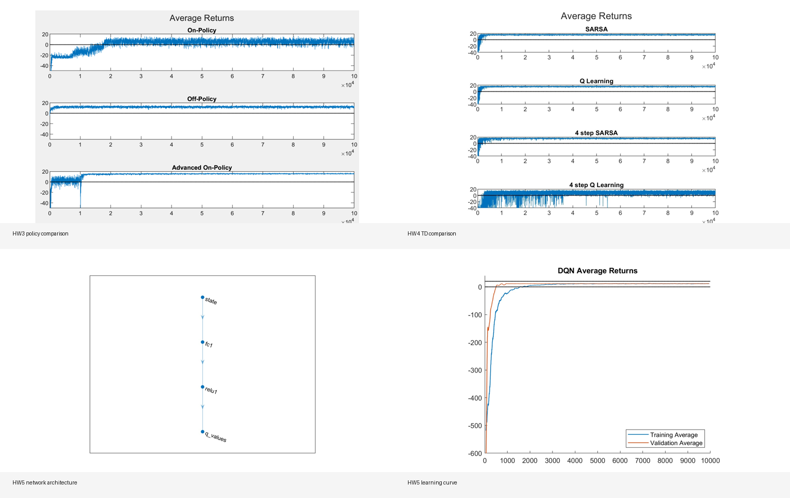
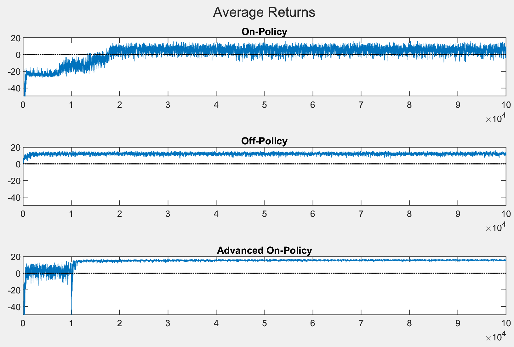
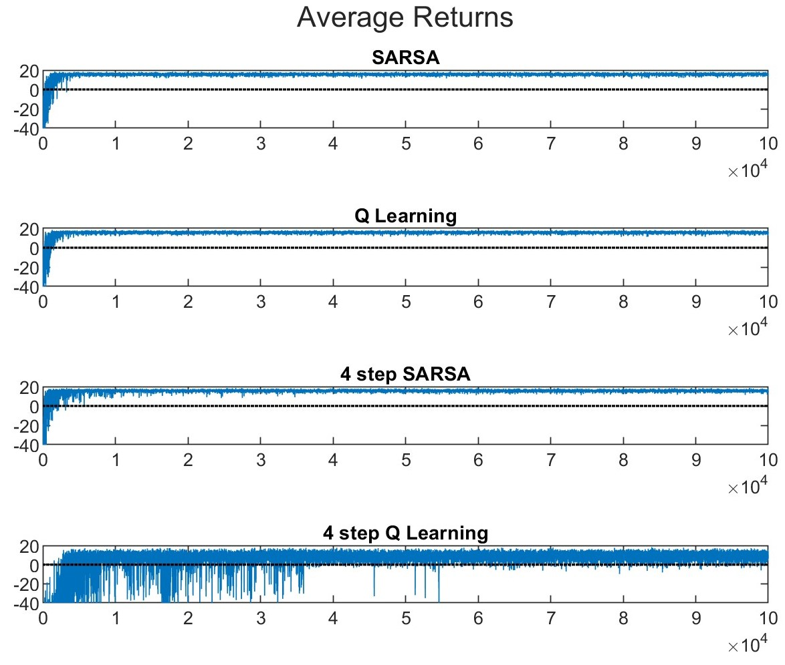
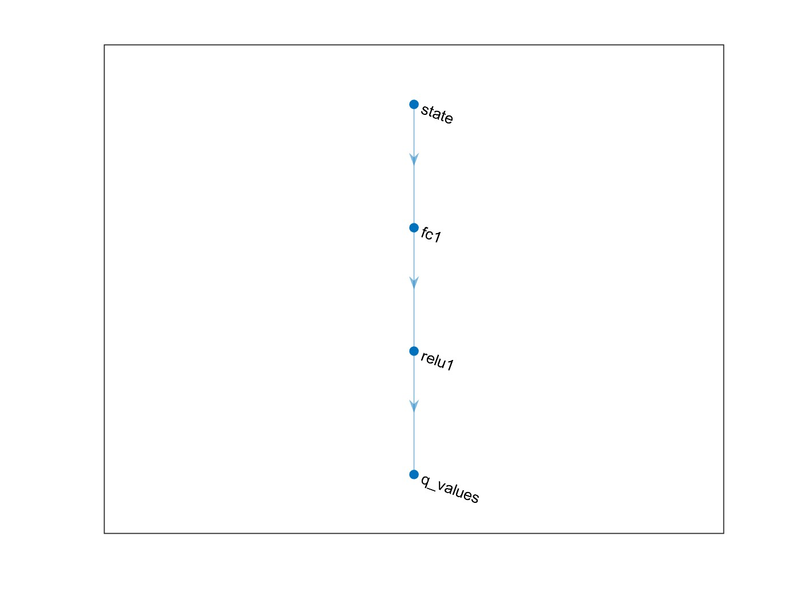
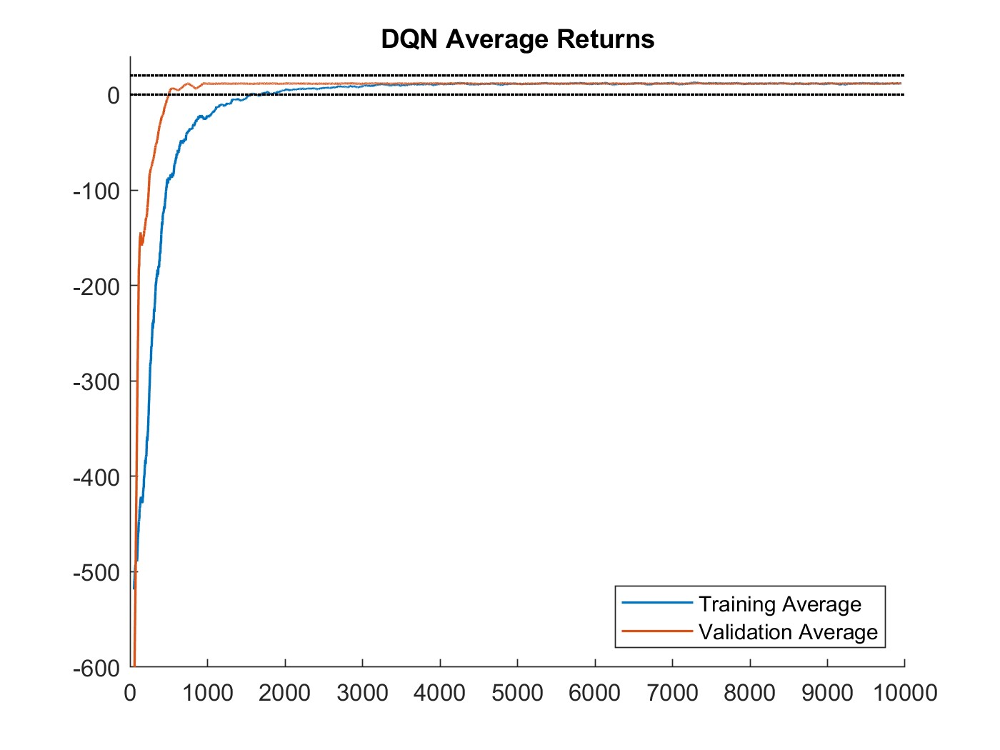

# Post-Delivery Game

Unified MATLAB experiments for a 5x5 post-delivery GridWorld.

This repo combines three related reinforcement learning projects into one clean source tree:

- Monte Carlo control with on-policy and off-policy methods
- Temporal-difference control with SARSA, Q-learning, and n-step variants
- Deep Q-Network control with replay and a target network

The same delivery environment is reused across the stages, so the project reads as one progression from tabular RL to deep RL.

## Overview



## What It Does

The code trains agents in a compact delivery-style GridWorld where the agent must navigate a 5x5 map with walls, interact with package states, and learn a near-optimal policy from experience.

Across the project, you will find:

- Environment construction for the delivery world
- Monte Carlo policy control
- TD learning with SARSA and Q-learning
- Multi-step control methods
- A neural DQN agent with replay and target updates
- Policy, value-function, and return visualizations

## Repository Layout

```text
.
|-- src/
|   |-- launch_post_delivery_game.m
|   |-- shared/
|   |   |-- clip_to_bounds.m
|   |   `-- build_post_delivery_tabular_world.m
|   |-- tabular/
|   |   |-- PostDeliveryTabularEnv.m
|   |   |-- on_policy_control.m
|   |   |-- off_policy_control.m
|   |   |-- sarsa_control.m
|   |   |-- q_learning_control.m
|   |   |-- n_step_sarsa_control.m
|   |   |-- n_step_q_learning_control.m
|   |   |-- run_monte_carlo_control.m
|   |   `-- run_td_control.m
|   `-- dqn/
|       |-- PostDeliveryDqnEnv.m
|       |-- DqnNetwork.m
|       |-- calc_dqn_gradients.m
|       |-- select_q_values.m
|       |-- train_dqn.m
|       |-- run_dqn_control.m
|       |-- data.mat
|       |-- data_backup.mat
|       `-- Backup/
|-- archive/
|   |-- HW3/
|   |-- HW4/
|   `-- HW5/
|-- assets/
|   `-- figures/
|-- README.md
`-- LICENSE
```

## Entry Points

| Experiment | Script |
| --- | --- |
| Monte Carlo control | `src/tabular/run_monte_carlo_control.m` |
| TD control | `src/tabular/run_td_control.m` |
| DQN control | `src/dqn/run_dqn_control.m` |
| Launcher | `src/launch_post_delivery_game.m` |

## Figures

The repository includes saved results from the original runs.

### Monte Carlo Control



### TD Control



### DQN Control





## How To Run

The project is MATLAB-based.

1. Open MATLAB.
2. Run `src/launch_post_delivery_game.m` to choose an experiment, or run a specific script directly.
3. The launcher and each entry point add the full `src/` tree to the MATLAB path automatically.

## Notes

- `HW3` and `HW4` now share a single tabular environment builder in `src/shared/build_post_delivery_tabular_world.m`.
- `HW5` uses its own DQN-specific environment and neural network implementation.
- The original homework folders are preserved under `archive/` so the cleaned root stays focused on source code.

## License

This project is released under the MIT License. See [`LICENSE`](LICENSE).
