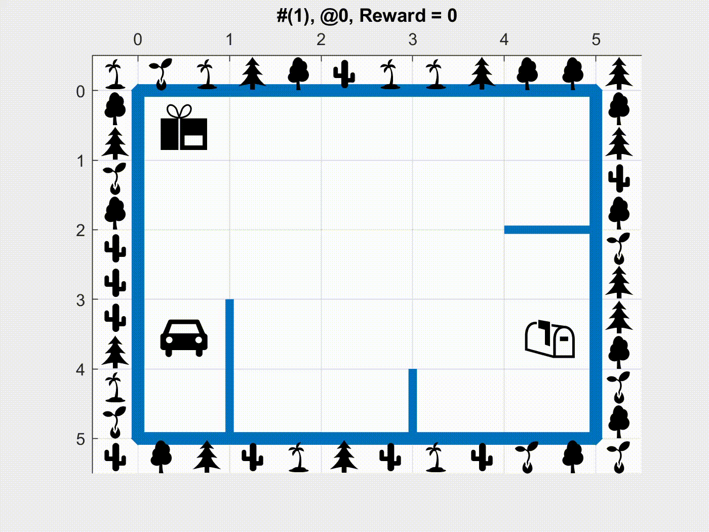
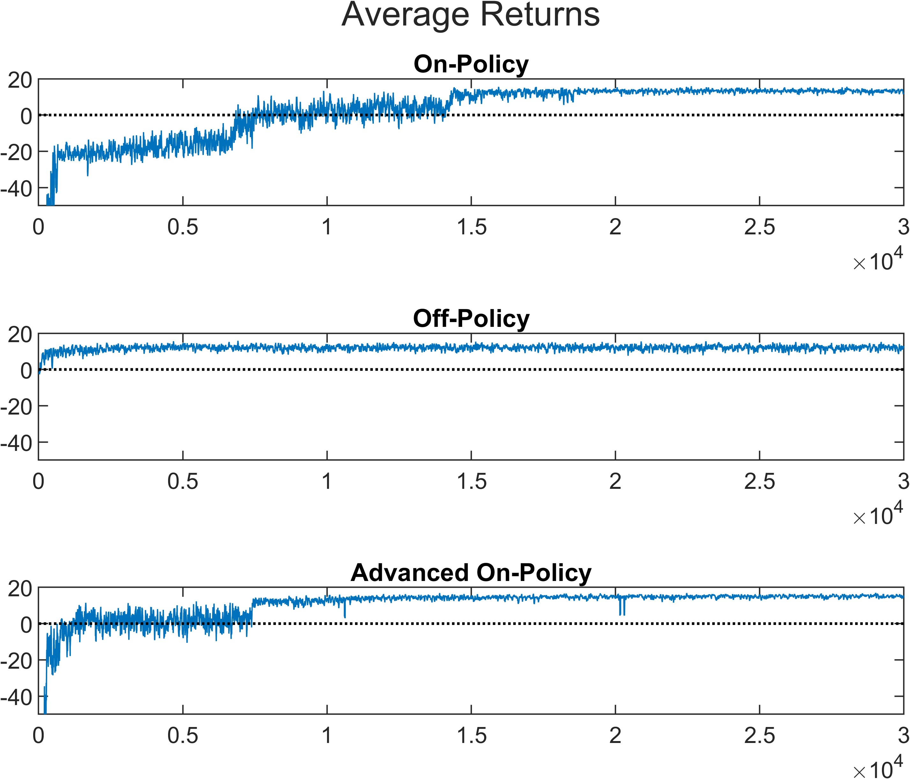
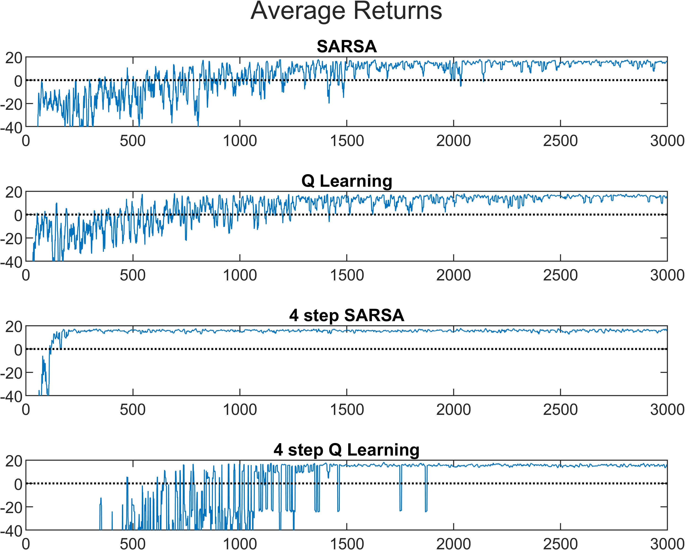
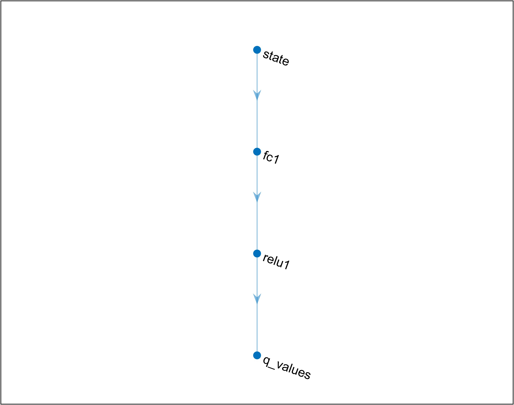
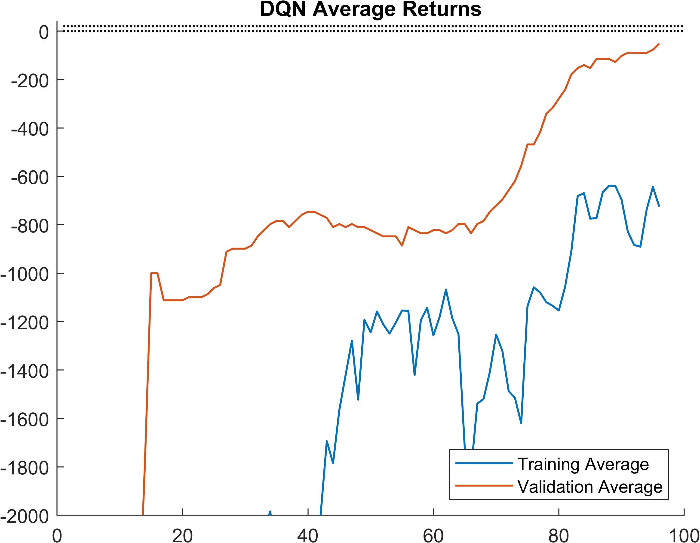

# Post-Delivery Game

Unified MATLAB experiments for a 5x5 post-delivery GridWorld.

This repo combines three related reinforcement learning projects into one clean source tree:

- Monte Carlo control with on-policy and off-policy methods
- Temporal-difference control with SARSA, Q-learning, and n-step variants
- Deep Q-Network control with replay and a target network

The same delivery environment is reused across the stages, so the project reads as one progression from tabular RL to deep RL.

## Overview


## What It Does

The code trains agents in a compact delivery-style GridWorld where the agent must navigate a 5x5 map with walls, interact with package states, and learn a near-optimal policy from experience.

Across the project, you will find:

- Environment construction for the delivery world
- Monte Carlo policy control
- TD learning with SARSA and Q-learning
- Multi-step control methods
- A neural DQN agent with replay and target updates
- Policy, value-function, and return visualizations

## Repository Layout

```text
.
|-- src/
|   |-- launch_post_delivery_game.m
|   |-- deep-q-network/
|	|	|-- Calc_grad.m
|	|	|-- Network.m
|	|	|-- clip.m
|	|	|-- data.mat			# pre-trained network 
|	|	|-- dqn_control.m
|	|	|-- dqn_post_delivery_environment.m
|	|	|-- run_dqn_control.m 
|	|	`-- select.m
|   |-- monte-carlo/
|	|	|-- build_monte_carlo_dynamics.m
|	|	|-- clip.m
|	|	|-- mc_post_delivery_environment.m
|	|	|-- off_policy_control.m
|	|	|-- on_policy_control.m
|	|	`-- run_monte_carlo_control.m
|   `-- temporal-difference/
|		|-- Q_Learning_control.m
|		|-- SARSA_control.m
|		|-- build_temporal_difference_dynamics.m
|		|-- clip.m
|		|-- n_QL_control.m
|		|-- n_SARSA_control.m
|		|-- run_td_control.m
|		`-- td_post_delivery_environment.m
|-- results/
|	|-- deep-q-network/
|	|	|-- dqn/
|	|	|	|-- # Generated figures 
|	|	|	`-- # Generated simulations
|	|	`-- Comparison.jpg
|	|-- monte-carlo/
|	|	|-- advanced_on_policy/
|	|	|	|-- # Generated figures 
|	|	|	`-- # Generated simulations
|	|	|-- off_policy/
|	|	|	|-- # Generated figures 
|	|	|	`-- # Generated simulations
|	|	|-- on_policy
|	|	|	|-- # Generated figures 
|	|	|	`-- # Generated simulations
|	|	`-- Comparison.jpg		# cpmparison of different MC control methods
|	`-- temporal-difference/
|		|-- n-QL
|		|	|-- # Generated figures 
|		|	`-- # Generated simulations
|		|-- n-SARSA
|		|	|-- # Generated figures 
|		|	`-- # Generated simulations
|		|-- QL
|		|	|-- # Generated figures 
|		|	`-- # Generated simulations
|		|-- SARSA
|		|	|-- # Generated figures 
|		|	`-- # Generated simulations
|		`-- Comparison.jpg		# cpmparison of different TD control methods
|-- reports/
|	|-- dqn-Report/
|	|	|-- pics/
|	|	`-- dqn_report.tex
|	|-- mc-Report/
|	|	|-- pics/
|	|	`-- mc_report.tex
|	`-- td-Report/
|		|-- pics/
|		`-- td_report.tex
|-- README.md
`-- LICENSE
```

## Entry Points

| Experiment | Script |
| --- | --- |
| Monte Carlo control | `src/monte-carlo/run_monte_carlo_control.m` |
| TD control | `src/temporal-difference/run_td_control.m` |
| DQN control | `src/deep-q-network/run_dqn_control.m` |
| Launcher | `src/launch_post_delivery_game.m` |

## Figures

The repository includes saved results from the original runs.

### Monte Carlo Control



### TD Control



### DQN Control





## How To Run

The project is MATLAB-based.

1. Open MATLAB.
2. Run `src/launch_post_delivery_game.m` to choose an experiment, or run a specific script directly.
3. The launcher and each entry point add the full `src/` tree to the MATLAB path automatically.


## License

This project is released under the MIT License. See [`LICENSE`](LICENSE).
